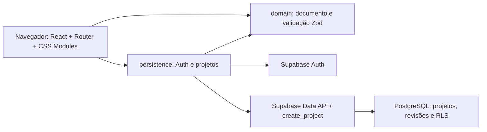
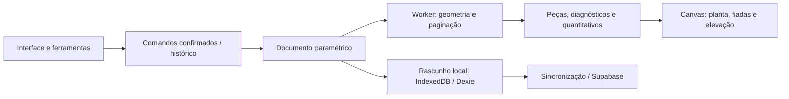

# Visão geral da arquitetura

Base normativa: [PRD 1.1](../PRD.md), seções 4–5 e 10. Decisão: [ADR-001](../adr/ADR-001-stack-tecnologica.md). Estado documentado: 07/10/2026.

## Arquitetura implementada em M0

A integração está codificada; o diagrama não comprova disponibilidade de um ambiente Supabase. Autenticação, criação e leitura reais ainda dependem de evidências de homologação. Testes E2E locais interceptam a rede.

O navegador apresenta autenticação, lista, criação de projeto e editor vazio. `persistence` concentra chamadas externas; `domain` valida o documento independentemente da interface. O módulo de projetos lista metadados em páginas de 20 e carrega o documento apenas ao abrir o editor.

M0 não tem backend próprio, worker, ferramentas de desenho, paginação, autosave ou IndexedDB. A tela vazia usa HTML/CSS. [M0 — Base](../milestones/M0-base.md) registra o aceite parcial.

## Fluxo planejado para o editor

Esse fluxo será construído entre M1 e M4. Cálculo não espera login nem rede; resultados são identificados por requisição/revisão/versão do motor. Prévia de arraste não confirma comandos nem entra no histórico.

Viewport, ferramenta e seleção ficam separados do documento. Exportações consomem o modelo ou saídas derivadas atuais; tokens e preferências privadas não entram nos arquivos.

## Autorização e persistência

- A identidade é determinada por Supabase Auth e `auth.uid()` no banco.
- Leitura exige usuário autenticado e propriedade; projetos excluídos são filtrados.
- RLS protege projetos e revisões. Mutações verificam explicitamente propriedade e documento em RPCs com `search_path` vazio.
- M0 implementa somente `create_project`; salvar/excluir e recuperação completa ficam em M4.
- Escrita direta nas tabelas por `anon`/`authenticated` está revogada nas migrações.
- A chave publicável é configuração do frontend, não um segredo nem uma regra de autorização.

Consulte o [modelo de dados](data-model.md) para documento, revisões e contratos.

## Desenvolvimento, testes e publicação

Um pacote npm. Vite serve o frontend local em 127.0.0.1:5173; Playwright usa 4173 e cache separado. Não é necessário Docker nem banco local para os testes do frontend.

Vitest verifica contratos locais; Playwright usa Supabase simulado; `test:cloud` executa verificações reais somente com homologação configurada. GitHub Actions foi definido no repositório; sua execução deve ser conferida no serviço.

Publicação planejada: Cloudflare Pages entrega `dist` e fallback SPA; Supabase fornece conta/banco. Produção terá HTTPS, ambiente separado, backup e restauração verificada. Node é ferramenta de desenvolvimento/build, sem processo próprio de backend em produção na arquitetura vigente.

## Evolução

Uma API própria com SQLite/MySQL é uma alternativa ainda não aprovada. Mudanças de infraestrutura não devem acoplar domínio ao banco nem eliminar testes equivalentes de autorização e integridade. Consulte [ADR-001](../adr/ADR-001-stack-tecnologica.md) e o [roadmap](../ROADMAP.md).
